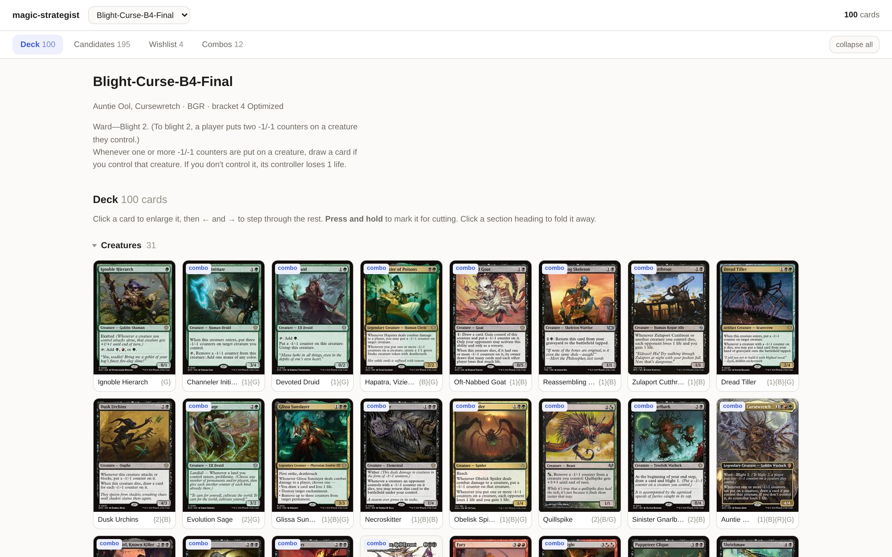
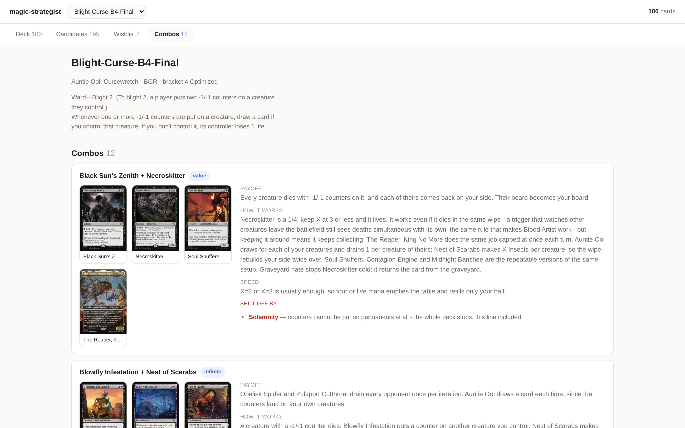
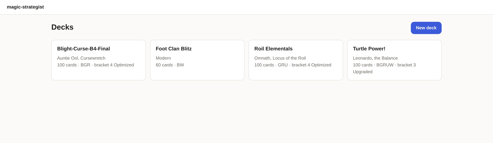

# magic-strategist

My Magic: The Gathering collection — Commander, Pauper Commander, Modern, Pauper
and Limited — as a queryable repository.

Card data lives in a SQLite database on disk. A Claude session queries what it
needs for the deck at hand instead of loading the whole collection into context.

**Everything runs in a container.** The only things installed on the host are
Docker and git — no Python packages, no virtualenvs, no `sqlite3`.

> **Want to use this for your own cards?** Read **[FORK.md](FORK.md)**.
> `make reset` empties the repository of my collection and leaves the machinery,
> so you can refill it from your own ManaBox export.
>
> The code is MIT ([LICENSE](LICENSE)). The card data is not mine to license —
> see [NOTICE.md](NOTICE.md).

## Getting running from a clean machine

You need Docker (with the daemon running) and git. Nothing else.

```bash
git clone https://github.com/massimilianobotticelli/magic-strategist.git
cd magic-strategist
make build
make validate
```

`make validate` works immediately on a fresh clone: the database and the cached
Scryfall responses are committed, so the repo is functional offline.

Anything that *fetches* from Scryfall — `make enrich`, `make sync-gc` — first
needs one line of setup, because Scryfall requires callers to identify
themselves and there is deliberately no default:

```bash
cp .env.example .env      # then set SCRYFALL_USER_AGENT
```

`make help` lists every command.

## The web app

```bash
make app          # http://localhost:8000
```

Pick a deck and it shows its cards with their real art, grouped by type,
alongside every card you own that is legal in that deck, and the registered
combos with their pieces and disablers.



**It has no authentication**, so `compose.yaml` publishes it on `127.0.0.1`
only. `APP_BIND=0.0.0.0` in `.env` — or inline, `APP_BIND=0.0.0.0 make app` —
opens it to the local network, which is useful for reading it off a phone while
sleeving and not something to leave running on a network you do not control.

It reads and writes the **same** `data/collection.db` the scripts use, which is
the point: a session records a proposed change in `deck_proposals`, you see it
in the app as red (cut) or green (add) with the reasoning next to it, and accept
or reject with one click. Marks you make yourself go back the same way. Neither
side edits `decklist.txt` until a change is deliberately applied, so the deck
list is never quietly rewritten by a conversation.

Card art is loaded from Scryfall, so the grid needs a connection the first time;
everything else works offline.

Deck, Candidates, Combos and Proposals are tabs in the sticky header, so nothing
is more than one click away. Type sections fold, and stay folded across reloads.
Click a card to see it full size; **press and hold** to mark it.

The Combos tab is the part I actually read before a game: each registered combo
with its pieces, how it works, how fast it is — and in red, the cards that shut
it off, because that is the detail notes keep losing:



The index is one card per deck, each with its format, colours and bracket:



## Building a new deck

Deck construction needs judgement, which the app cannot do on its own. So the
two halves talk through the database:

1. **"New deck"** in the app opens a form — format, colours, a commander you have
   in mind, the strategy in free text, and whether cards may be taken out of
   decks that are currently assembled. Everything is optional. It writes a row
   into `deck_requests`.
2. **`/new-deck` in a session** picks up anything still pending, builds from what
   the collection actually holds, and writes the result back as a deck with
   `status = 'draft'`.
3. The draft shows up in the app like any other deck, and is refined with the
   same proposal mechanism until it is promoted to `active`.

The skill also works straight from a conversation, with no request row.

### Supported formats

| Format | Size | Copies | Commander | Rarity |
|---|---|---|---|---|
| Commander | exactly 100 | 1 | yes | any |
| Pauper Commander | exactly 100 | 1 | uncommon creature | commons |
| Modern | 60+ (+15 sideboard) | 4 | no | any |
| Pauper | 60+ (+15 sideboard) | 4 | no | commons |
| Limited | 40+ | unlimited | no | any |

`scripts/formats.py` holds the rules and `validate.py` enforces them per deck,
so a Modern deck is never held to Commander's 100-card singleton rule. Card
legality comes from the committed Scryfall cache, so it costs no API calls.
Limited has an empty legality key on purpose: if I opened it, I may play it.

The working tool is:

```bash
make query ARGS='available --format pdh --colors GU'
make query ARGS='available --format modern --role spot-removal --borrow'
```

Owned cards legal in a format, filtered by colour, role and type. Without
`--borrow` it lists only what costs nothing — the loose pools and donor decks.

## What each script does

| Script | What it does |
|---|---|
| `import_manabox.py` | Reads a ManaBox CSV export, keyed on its `Scryfall ID` column — an exact printing key, so reprints and double-faced cards are unambiguous. `Binder Type` maps straight onto the model: `deck` → a deck, `binder` → a loose pool, `list` → wishlist entries. Also parses plain decklists (`1 Card Name (SET) 123`, optional `*F*`, `// COMMANDER` markers). |
| `enrich.py` | Fetches real card data from the Scryfall API and fills the `cards` table, then tags roles and materialises `copies`. Batches of ≤75 identifiers, throttled under 10 req/s, every response cached to `data/scryfall/`. `--names` fetches cards that are referenced but not owned — combo disablers, mostly. |
| `sync_gamechangers.py` | Refreshes the official Commander Game Changers list from Scryfall's `is:game-changer` search into `knowledge/game-changers.json`. Reports owned Game Changers separately from wishlisted ones. |
| `validate.py` | Every deck and collection check. Exits non-zero on failure. |
| `query.py` | Focused questions about decks, cards, combos, the loose pools and the wishlist. |
| `moves.py` | What to physically move in ManaBox so its binders match the decklists, and where to take each card from. The check `validate` cannot do — see below. |
| `export_state.py` | Writes `data/app-state.sql`, the committed home for the tables the web app writes. Without it a rebuild discards every proposal and deck request. |
| `reset.py` | Empties the repository of this collection so a fork can be filled with another. Dry run unless `--yes`. See [FORK.md](FORK.md). |

Plus two library modules the scripts share: `db.py` (connection, schema,
materialisation) and `scryfall.py` (the throttled, cached API client).
`roles.py` derives deck-building roles from oracle text, and `formats.py` is the
authority on deck size, singleton and rarity rules.

All of them take `--help`.

## What the validator checks

- Every active deck is **its own format's size** — 100 for Commander and PDH,
  60+ for Modern and Pauper, 40+ for Limited. Not always 100.
- **Copy limits** for the format: singleton in Commander and PDH, four in the
  60-card formats, basics excepted
- **Physical copies vs. deck demand** — the one that matters, see below
- Every deck card is **inside the commander's colour identity** (Commander and
  PDH only; a 60-card deck is not held to a Commander rule)
- **Game Changers vs. target bracket**: 1–2 → 0, 3 → max 3, 4–5 → unlimited
- **Registered combos vs. bracket** — warns when a combo has every piece present
  but the deck targets bracket 1 or 3
- **Combo notes against the deck** — a combo piece the deck no longer runs is a
  failure; a card named in the prose but absent is reported as a note, since
  "X was cut for costing four" is legitimate history
- Non-English printings, cards owned in multiples, and any ManaBox row that
  could not be imported

Two things it deliberately does **not** check, and both drift silently:

- **Basic lands are exempt** from the copy and supply checks, so a deck asking
  for more Forests than I own passes.
- **It checks supply, not location.** It asks "do enough copies exist
  anywhere?", never "is the copy in this deck's own binder?" — so a decklist can
  be edited, imported and validated clean while the cards still sit in a pool,
  reading as free inventory. `make moves` is the check that catches that.

## Weekly workflow

**1. Export from ManaBox** and drop the CSV into a dated folder:

```bash
mkdir -p data/manabox/$(date +%F)
```

**2. Import it, fetch any new cards, refresh the Game Changers list:**

```bash
make import ARGS='data/manabox/2026-07-26/ManaBox_Collection.csv'
make enrich
make sync-gc
```

**3. After changing a decklist**, re-import that deck, validate, and find out
what has to physically move:

```bash
make import ARGS='decks/blight-curse-b4-final/decklist.txt'
make validate
make moves      # what to move in ManaBox, and where to take each card from
```

`moves` prints a list rather than nagging card by card, because the physical
moves are worth batching to the end of a session.

Deck formats and statuses, brackets, commanders that can't be inferred, combos,
effective costs and wishlist detail live in `data/seed.sql`. Edit it and
re-apply — it is idempotent, and `data/seed.example.sql` is the commented
template of every block it can hold:

```bash
make seed
```

**4. Ask the collection things:**

```bash
make query ARGS='decks'
make query ARGS='deck blight-curse-b4-final --roles'
make query ARGS='card "Obelisk Spider"'
make query ARGS='combos --deck blight-curse-b4-final'
make query ARGS='pool --color-identity BRG --type creature'
make query ARGS='wishlist'
```

**5. Commit**, refreshing the text dump so the history is diffable:

```bash
make dump
git add -A && git commit -m "collection: <what changed>"
```

## Rebuilding from scratch

The database is derived from the committed raw exports, decklists and Scryfall
cache, so it can always be rebuilt without network access:

```bash
make rebuild
```

## Layout

```
.devcontainer/       Dockerfile + devcontainer.json (Python 3.12, non-root)
.github/workflows/   CI: ruff, then rebuild-from-files and validate
app/                 FastAPI web app: main.py, queries.py, templates/, static/
compose.yaml         same image, editor-independent
.env.example         local settings — copy to .env (gitignored). Required for
                     anything that fetches from Scryfall.
Makefile             every command, containerised
pyproject.toml       ruff config. No package is built here.
data/
  collection.db      SQLite — the source of truth (committed)
  collection.sql     text dump of the same, so git diffs are readable
  app-state.sql      the app's own tables: proposals and deck requests
  seed.sql           facts no import can derive: formats, brackets, combos
  seed.example.sql   commented template of the above, for a fresh start
  manabox/<date>/    raw ManaBox exports — committed, never edited
  scryfall/          cached API responses (committed)
decks/<slug>/        decklist.txt, strategy.md, upgrades.md
pool/                notes on the loose card pools
knowledge/           brackets.md, game-changers.json
scripts/             the scripts above, plus db.py, scryfall.py,
                     roles.py, formats.py and schema.sql
.claude/             rules/ · commands/ (/session) · skills/ (new-deck)
FORK.md              how to empty this and refill it with your own cards
LICENSE · NOTICE.md  MIT on the code; the card data is Wizards'
```

## Design notes

**Cards, printings and copies are three different things.** `cards` is the
abstract card keyed by Scryfall `oracle_id`; `printings` is a specific physical
printing keyed by Scryfall `id`; `copies` is one physical card I own, in exactly
one location. Deck *lists* live separately again in `deck_cards`, because what a
deck is supposed to contain and what is physically sleeved in it are different
claims that can disagree — and when they disagree, that is exactly what I want
to be told.

**On owning one copy of everything.** I thought I owned exactly one physical
copy of every card. I don't: every Commander precon ships its own Sol Ring,
Arcane Signet and Command Tower, so several staples exist in triplicate. The
rule that actually matters is **supply vs. demand** — if more *active* decks
list a card than there are physical copies, building one deck strips another.
`validate.py` checks that, and a copy having exactly one location makes "in two
decks at once" structurally impossible.

**Deck status.** Every deck is `active`, `donor`, `retired` or `draft`.

- **active** — kept assembled, held to its format's size, competes for cards.
- **donor** — cannibalised for parts. Not held to size, skipped by the colour and
  bracket checks, and it makes no claim on a card an active deck wants. Its
  cards are available inventory and show up in `query.py pool` tagged `(donor)`.
  A donor's `decklist.txt` is usually stale on purpose — `copies` is the truth.
- **retired** — kept for the record only.
- **draft** — generated by the `new-deck` skill, not yet accepted.

That distinction is what lets a deck be taken apart for a better one without
lying about it afterwards. A bracket-4 upgrade that physically pulls five cards
out of another deck leaves that deck at 95, and marking it `donor` says so,
instead of leaving a 100-card list that no longer exists on the table.

**What the collection can actually support.** *(as of 2026-08-13)* 418 distinct
cards across 570 physical copies. Of the 413 non-basic ones, **368 exist as a
single copy**, 45 in two or more, and only **two as a full playset** — so
duplicates exist, but they are the accident of precons shipping the same
staples, not a deliberate stock.

Format by format: 410 Commander-legal cards, 315 Modern-legal, and 145 that are
legal in both Pauper and Pauper Commander. Commander and PDH are singleton, so
the shape of the collection costs nothing there. Modern and Pauper come out
near-singleton: fine for the casual games I play, and the builder is expected to
say which cards would want a second or third copy rather than pretend otherwise.

**Combo disablers are first-class.** `combo_disablers` records the cards that
shut a combo *off*, because that is the detail my notes kept losing. Melira,
Sylvok Outcast turns both of Blight Curse's infinite combos off, and in the old
notes it survived only as a parenthetical under "rejected additions". Combos
also carry their stop conditions: the Blowfly Infestation loop draws a forced
card every iteration, so an unclosable loop decks you.

**Why the database is committed.** I want the full history of how the collection
changed over time, and I want the repo to work offline. `data/collection.sql` is
a text dump of the same data so `git log -p` shows something readable.

## Licence, and the card data

The code, the container setup and my own deck notes are MIT — see
[LICENSE](LICENSE). Take them.

The card names, rules text, mana costs and set names in `data/` are **not mine
to license**. They are © Wizards of the Coast, and this repository relies on
their Fan Content Policy: it is non-commercial, unofficial, and not endorsed by
Wizards. Card images are never stored here — the web app hotlinks them from
Scryfall at display time. [NOTICE.md](NOTICE.md) has the full statement and the
Scryfall attribution.

You do not need my cards anyway. [FORK.md](FORK.md) is the guide to emptying
this repository and refilling it from your own collection:

```bash
make reset              # shows what would go. Deletes nothing.
make reset ARGS=--yes
```
